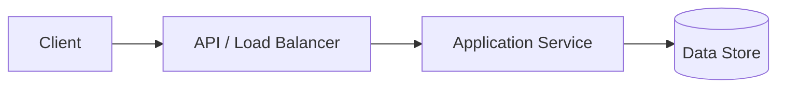

# Solution

## Executive summary

Summarize the design and its defining trade-offs in a few sentences.

## Goals and non-goals

### Goals

- TBD

### Non-goals

- TBD

## High-level architecture

Describe each component's responsibility and why it is needed.

## APIs and contracts

Document the important endpoints, events, or interfaces, including error and
idempotency behavior where relevant.

## Data model

Document key entities, identifiers, indexes, relationships, retention, and
partitioning choices.

## Core flows

### Write path

1. TBD

### Read path

1. TBD

## Scaling strategy

Cover expected bottlenecks, caching, partitioning, replication, hot keys, and
how the architecture evolves as load grows.

## Reliability and failure handling

Cover timeouts, retries, idempotency, degradation, recovery, and regional
failure where relevant.

## Consistency and correctness

State the consistency model, invariants, concurrency behavior, and accepted
failure windows.

## Security and privacy

Cover authentication, authorization, encryption, abuse prevention, data
minimization, and compliance where relevant.

## Observability and operations

List the most useful service-level indicators, alerts, logs, traces, dashboards,
and operational procedures.

## Trade-offs and alternatives

| Choice | Benefit | Cost/risk | Why chosen |
| --- | --- | --- | --- |
| TBD | TBD | TBD | TBD |

## Remaining risks

- TBD
